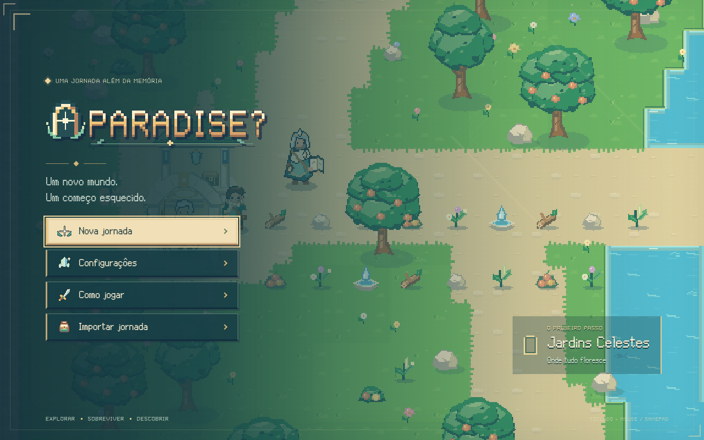
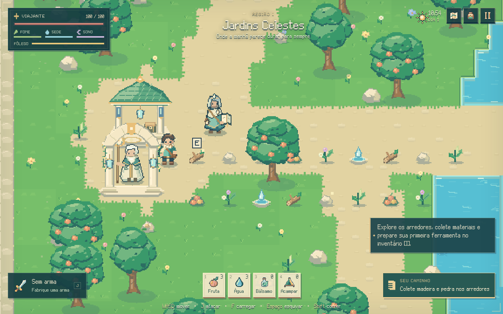

# Paradise?

Jogo de exploração, sobrevivência, crafting e combate em **pixel art 2D**, com visão de cima, para PC e Android. A campanha percorre dez biomas e vinte grandes invasores, com narrativa e interface em português brasileiro.

O documento de referência é [Paradise_Documento_Mestre_2D_Pixel_Art.pdf](Paradise_Documento_Mestre_2D_Pixel_Art.pdf), preservado na raiz. Sua extração integral está em `docs/documento-mestre.txt`.

## Aplicativos para jogar

Baixe os aplicativos na [release para PC e Android](https://github.com/Girao-Henrique/Teste-1/releases/tag/v1.1.0-pre.1):

- [Windows 64 bits — executável portátil](https://github.com/Girao-Henrique/Teste-1/releases/download/v1.1.0-pre.1/Paradise-Windows-x64.exe).
- [Android 8+ — APK](https://github.com/Girao-Henrique/Teste-1/releases/download/v1.1.0-pre.1/Paradise-Android.apk).

Esta é a atualização visual 1.1.0, distribuída como versão de testes. A campanha, os menus e os layouts adaptativos foram verificados, e o executável abriu no Windows. O APK teve assinatura e instalação verificadas; seu fluxo nativo ainda precisa de confirmação em aparelho Android, pois o WebView do emulador falhou antes de carregar o jogo. O Android requer Android System WebView atualizado. Consulte os testes e limites em [validação](docs/validacao.md).

O executável Windows está em `builds/windows/Paradise-Windows-x64.exe`; o APK Android está em `builds/android/Paradise-Android.apk`. Ambos incorporam o jogo e funcionam offline, sem endereço localhost. Consulte [instalação e geração de versões](docs/distribuicao.md). No celular, retrato e paisagem são jogáveis com controles de toque. A tela cheia acompanha o formato da tela.

## Apresentação da atualização





Mais imagens: [fabricação](docs/imagens/fabricacao.png) e [celular em retrato](docs/imagens/celular.png).

## Executar no ambiente de desenvolvimento

Requer Node.js 22 ou superior e um navegador atual (Chrome, Edge ou Firefox).

```bash
npm start
```

Abra **http://localhost:5173**. Não é necessário instalar pacotes, criar conta ou ter internet. A janela pode entrar em tela cheia pelo menu de configurações. Para usar outra porta, defina `PORT` antes de executar.

## Jogar

- **WASD / setas:** mover; **Shift:** correr.
- **J / clique esquerdo:** atacar; **segurar F / botão direito:** carregar golpe.
- **Espaço:** esquivar; **Tab:** alternar alvo.
- **E:** coletar, conversar, usar pontos de apoio e passar para outra região.
- **I:** inventário; **B:** fabricação; **M:** mapa; **N:** diário.
- **1 / 2 / 3 / 4:** comer, beber, curar e montar acampamento.
- **R:** poção da missão; **C:** habilidade especial quando adquirida.
- **Esc:** pausar ou voltar; **Tab / setas / Enter:** navegar pelos menus.

O gamepad usa os dois analógicos para mover e mirar, A/✕ para atacar, B/○ para esquivar, X/□ para interagir e Y/△ para carregar golpe. RT/R2 corre, LB/L1 alterna alvo, RB/R1 ativa a habilidade especial, Select abre a mochila e Start pausa. O direcional usa provisões e a poção. A/✕ confirma e B/○ volta nos menus.

O Porteiro recebe o viajante; o Guia explica a missão. Colete materiais, fabrique uma ferramenta e uma arma, cuide das provisões e procure caminhos opcionais. Golpes anunciados no chão deixam tempo para se posicionar ou esquivar. Não há XP, níveis nem metas de extermínio de inimigos comuns.

Pontos fixos oferecem descanso, fabricação, reparos, melhorias, baú, checkpoint e viagem rápida. Os baús são separados por região. Acampamentos permitem dormir e não alteram o checkpoint. O diário acompanha os grandes invasores e ingredientes pendentes.

## Salvamentos

A progressão é salva automaticamente neste aplicativo ou navegador, inclusive ao encontrar ingredientes, vencer chefes, visitar pontos de apoio e em intervalos durante a exploração. O salvamento manual ocorre nos pontos fixos. A morte devolve o jogador ao último checkpoint e remove parte dos recursos comuns; equipamentos e ingredientes são preservados.

O menu de pausa permite **exportar e importar um JSON** para backup ou mudança de computador. Limpar os dados do navegador apaga os salvamentos locais. A pasta `saves/` serve para guardar backups exportados no projeto; os arquivos pessoais não entram no Git.

## Sistemas e apresentação

- Dez regiões semiabertas com rios, pontes, cavernas, ruínas, mirantes, segredos e arenas.
- Sete categorias de arma com alcance, ritmo, área e fôlego distintos; ataque carregado, esquiva e assistência de mira.
- Ferramentas, crafting, durabilidade, reparos e melhorias compactas.
- Saúde, fome, sede e sono; ciclo de 13 minutos e pressão por privação de sono após cerca de 3,5 ciclos.
- Vinte chefes com silhuetas próprias, padrões e fases; nove ingredientes e progressão completa até a sequência final.
- Lapsos discretos, replays de momentos registrados durante a partida e encerramento estabelecido no Documento Mestre.
- Sprites, retratos, ícones, fonte, marca, cenários e animações originais. Tiles de 16 pixels, canvas com proporção adaptativa e ampliação sem suavização. A arte é construída diretamente em pixels.
- Música, ambiência e efeitos originais sintetizados localmente com WebAudio.

Todos os menus, diálogos e cenas importantes pausam a simulação. A noite preserva a paleta acolhedora e a legibilidade.

## Verificação

```bash
npm run check
npm test
```

Os testes cobrem sobrevivência, crafting transacional, armas, armazenamento regional, acampamento, salvamento, progressão, conectividade dos mapas e campanhas nas duas dificuldades. O percurso de campanha usa deslocamento assistido entre pontos e combate pela API real da simulação.

`EXPORT_CAMPAIGN=1 npm test` gera o save final usado pelo teste de interface. Com o servidor ativo, `node tests/browser.mjs` executa a verificação de interface com Playwright, quando disponível no ambiente de desenvolvimento, e guarda imagens em `tests/artifacts/`. As dezesseis folhas PNG exportadas e o catálogo estão em `assets/`; `node scripts/export-art.mjs` as atualiza. Playwright não é uma dependência de execução do jogo.

## Organização

- `src/game/`: simulação e sistemas.
- `src/world/`: cenas de exploração, mapas, tiles e colisões.
- `src/render/`: sprites, animações, terreno e efeitos em pixel art.
- `src/data/`: biomas, personagens, itens, receitas, chefes e narrativa.
- `src/ui/`: inventário, fabricação, mapa, diário e outros menus.
- `src/audio/`: trilha, ambiência e efeitos.
- `assets/`: referências e recursos de produção do próprio jogo.
- `desktop/`: aplicativo Electron para PC.
- `android/`: aplicativo Android e recursos nativos.
- `builds/`: executável Windows, APK e arquivos temporários de compilação; fora do Git.
- `saves/`: backups exportados pelo jogador.
- `tests/`: validações de sistemas, campanha e navegador.
- `docs/`: Documento Mestre extraído, arquitetura e notas de narrativa.

A publicação dos aplicativos usa o workflow manual do GitHub Actions. [Direção de arte](docs/direcao-arte.md), [testes visuais](docs/qa-visual.md) e [distribuição](docs/distribuicao.md) documentam a atualização.
